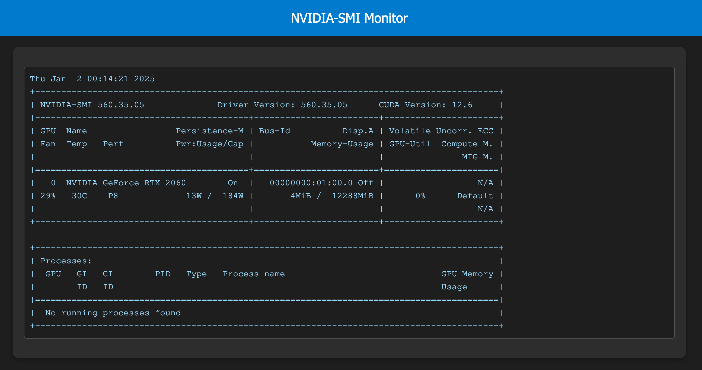

# NVIDIA-SMI Monitor

Это приложение предназначено для вывода информации с команды `nvidia-smi` в реальном времени через WebSocket.



## Установка

### Клонируйте репозиторий

```bash
  git clone <url-репозитория>
  cd nvidia-monitor
```

### Установите зависимости

```bash
  npm install
```

### Установите PM2 (если он не установлен глобально)

```bash
  npm install pm2 -g
```

### Создайте файл .env из шаблона

```bash
  cp .env.example .env
```

Откройте файл .env и настройте нужные переменные окружения.

## Запуск

### Стандартный запуск

Для того, чтобы запустить приложение без использования PM2, используйте команду:

```bash
  npm start
```

Это запустит сервер на порту 4000 (или на порту, указанном в переменной окружения).

### Остановка приложения

```bash
  npm run stop
```

### Перезапуск приложения

```bash
  npm run restart
```

### Удаление приложения из PM2

```bash
  npm run delete
```

Структура проекта:

```text
/nvidia-monitor
|-- /public
|   |-- index.html  (статический HTML)
|-- index.js    (серверная логика)
|-- .../
|-- package.json
```

Технологии:

```text
 • Node.js для создания сервера.
 • Express для обработки HTTP-запросов.
 • WebSocket для передачи данных в реальном времени.
 • PM2 для управления процессом приложения.
```

## Лицензия

Этот проект распространяется под лицензией MIT.
